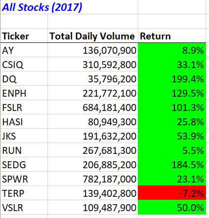
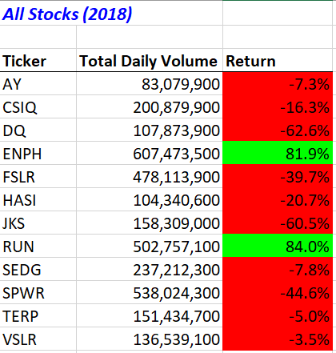
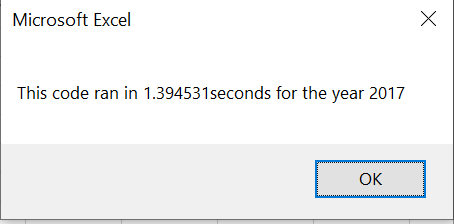
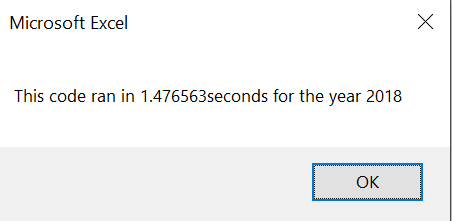
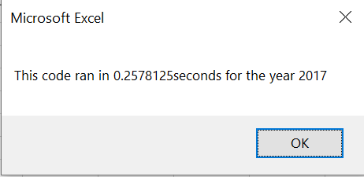
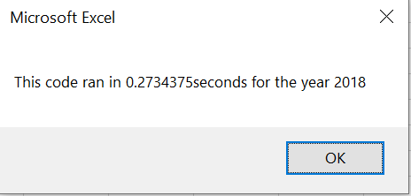

# stocks-analysis
Analysis on green stocks

## Overview of Project

The purpose of this analysis is to help Steve pick a green stock based on its past performance. To achieve this, we set up a system for Steve where he can easily compare the past performance on each of the stocks (ticker symbols) by extracting data on total daily volume and percentage of return. We have also set up a timer function to give Steve a better understanding on how long exactly will it take for the system to give reesults.

## Results

### Stock Performance
  

 As we can see from the tables, in 2018, most stocks are losing as compared to their return in 2017. The only two stocks that are continuing winning are the ones in green in both tables.These stocks are the ENPH and RUN. DQ's return in 2017 and 2018 has the biggest difference. In VBA, we used the formula *Cells(4 + i, 3).Value = tickerEndingPrices(i) / tickerStartingPrices(i) - 1* to calculate percentage of return.

### Execution Times
#### Original Script  
  

  

#### Refactored Script  
    

  

 Refactored script shortened more than 1.0 second of execution time for timers in both year values.

## Summary
### Procs and Cons Of Refactoring Code
Refactoring code improved the codebase in its design, structure and functionality. It is faster to execute and is more clear, and simple in design. 
However, refactoring code is time-consuming and risky. It is also very easy to make mistakes and introduce bugs. 
### Pros and Cons Of The Original and Refactored Script
In the refactored script, we used the tickerIndex as the index when accessing the arrays, and initialized the tickerVolume to zero. Then, we used the tickerIndex variable as an index to increase the column of the current tickerVolumes. Compared to the original script, these steps are faster and more concise, while they are also easier to maintain and debug. As a result, it takes shorter time to run the refactored script as shown above. 
